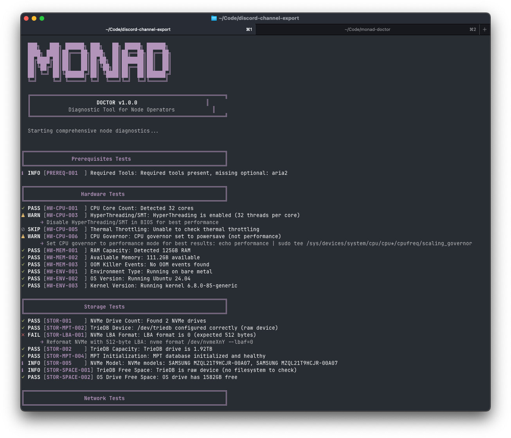

# monad-doctor


```
curl -sSL https://raw.githubusercontent.com/monad-internal/monad-doctor/main/monad-doctor.sh | sudo tee /usr/local/bin/monad-doctor > /dev/null && sudo chmod +x /usr/local/bin/monad-doctor
```

## Usage
```
  # Run diagnostics
  monad-doctor

  # JSON output
  monad-doctor --json

  # Help
  monad-doctor --help

  Update to Latest Version

  curl -sSL https://raw.githubusercontent.com/monad-internal/monad-doctor/main/monad-doctor.sh -o /usr/local/bin/monad-doctor
```
